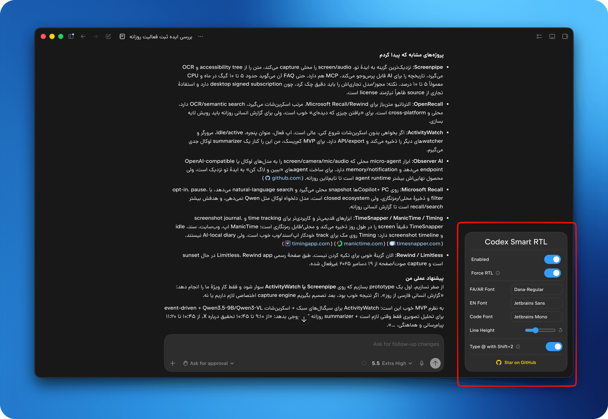

<a id="english"></a>
# ChatGPT/Codex Smart RTL & UI Patcher

**English** · [العربية](#arabic) · [فارسی](#persian)

A smart RTL (Right-to-Left) patcher for the ChatGPT desktop app with Codex, as well as legacy standalone Codex installations. It brings polished support for Persian (Farsi), Arabic, Hebrew, and other RTL languages.



Codex Smart RTL injects an RTL engine into the app, fixes mixed-direction typing issues, and adds a small settings panel for fonts, line height, and layout preferences.

## Features

- **Smart Auto-Direction**: Automatically detects if a paragraph is RTL or LTR and aligns it perfectly.
- **Force RTL Mode**: Want everything aligned to the right? Just toggle the switch.
- **Custom Typography**: Define different fonts for RTL text, English text, and code blocks.
- **Line Height Control**: A precise slider to adjust the line height for better readability.
- **Persian Keyboard Fix**: Maps `Shift + 2` to type `@` instead of `٬` on Persian keyboards.
- **Beautiful Settings Panel**: A floating, non-intrusive UI widget at the bottom right corner.
- **Vazirmatn Built-in**: Comes with the beautiful Vazirmatn variable font by default.
- **Theme Compatibility**: Seamlessly adapts colors based on Codex's active theme, using native color variables.

## Installation

You don't need to download any files manually. Install Node.js first, then run the command for your operating system.

The patcher automatically prefers the current `/Applications/ChatGPT.app` Codex bundle and falls back to a legacy `Codex.app`. `ChatGPT Classic.app` is not a patch target because it does not use an Electron `app.asar` archive.

### macOS
Before running the patcher, make sure [Node.js](https://nodejs.org) is installed. You can install it from the official website, or if you already use Homebrew:
```bash
brew install node
```
Simply run:
```bash
npx codex-rtl
```
Quit ChatGPT/Codex before running the command. To patch a non-standard installation explicitly:

```bash
npx codex-rtl --asar "/full/path/to/app.asar"
```

> **First time?** If you get a "Permission Denied" error, the tool will **automatically open** the App Management settings page for you. Just enable the toggle for your terminal app, then run the command again. No `sudo` needed!
>
> You can also grant permission manually: `System Settings > Privacy & Security > App Management`.

### Linux
```bash
sudo apt install nodejs npm # Skip this line if Node.js is already installed.
sudo npx codex-rtl
```

### Windows
Open **PowerShell** as **Administrator** (Right-click -> Run as Administrator), then run:
```powershell
winget install OpenJS.NodeJS.LTS # Skip this line if Node.js is already installed.
npx codex-rtl
```

> [!WARNING]
> **App Updates:** Since updating ChatGPT/Codex overwrites its internal files, the RTL patch will be removed. You will need to run the installation command again after each update to re-apply the patch.

## Restoring to Original (Uninstall)

If you ever want to revert ChatGPT/Codex back to its original state (before the patch), quit the app and run the command with the `--restore` flag:

```bash
npx codex-rtl --restore
```
*(On Linux, run with `sudo`. On Windows, run in an Administrator terminal)*

## How it works

This CLI tool:

1. Locates the current ChatGPT/Codex or legacy Codex installation.
2. Stores a versioned backup outside the signed application bundle in `~/.codex-rtl/backups/`.
3. Reads the real Electron entry point from `package.json` instead of assuming a fixed bootstrap filename.
4. Preserves native `app.asar.unpacked` metadata while injecting the Smart RTL Engine.
5. On macOS, updates `ElectronAsarIntegrity` to match the repacked archive header.
6. On macOS, preserves the official bundle files needed for restore, re-signs only the outer app bundle ad-hoc, and verifies the complete bundle. An already broken or ad-hoc app must be reinstalled before patching.

## Development

The injected browser payload is assembled from source modules, so edits go in `src/`, not the generated `bin/payload.js`:

- `src/rtl-core.cjs` — pure, DOM-free detection engine (script ranges, LaTeX/arithmetic isolation, table direction). Unit-tested.
- `src/rtl-payload.js` — the DOM layer (observer, per-element direction, math islands, conversation scoping).
- `src/rtl-widget.js` — the floating settings panel.
- `tools/build-payload.mjs` — assembles the above into `bin/payload.js`.

```bash
npm run build   # regenerate bin/payload.js from src/
npm test        # rebuild, then run unit + jsdom payload smoke tests
```

`npm test` runs the pure-logic unit tests **and** a jsdom smoke test that executes the fully assembled payload against a mock DOM — this catches assembly/scope/substitution regressions that unit tests alone cannot. Please keep it green when adding enhancements.

## Contributing

Feel free to open issues or submit pull requests. Let's make Codex accessible and beautiful for everyone!

---

<a id="arabic"></a>

<div dir="rtl">

# مُصحِّح ChatGPT/Codex الذكي لدعم الكتابة من اليمين إلى اليسار

[English](#english) · **العربية** · [فارسی](#persian)

مُصحِّح ذكي لدعم الكتابة من اليمين إلى اليسار (RTL) لتطبيق ChatGPT لسطح المكتب المدمج مع Codex، وكذلك نسخ Codex المستقلة القديمة؛ يجلب دعمًا متقنًا للعربية والفارسية والعبرية وغيرها من اللغات التي تُكتب من اليمين إلى اليسار.

يقوم Codex Smart RTL بحقن محرك RTL داخل التطبيق، ويعالج مشكلات الكتابة المختلطة الاتجاه، ويُصحِّح أزرار التحكم الأصلية بالنافذة على أنظمة RTL، ويضيف لوحة إعدادات صغيرة للخطوط وارتفاع السطر والتخطيط.

## المميزات

- **الاتجاه التلقائي الذكي**: يكتشف تلقائيًا ما إذا كانت الفقرة عربية/RTL أو إنجليزية/LTR ويضبط محاذاتها بدقة — حتى أثناء وصول الرد المتدفق.
- **بقاء المعادلات والشيفرة قابلة للقراءة**: تُعزل العمليات الحسابية المجردة (`2 + 3 = 5`) ومعادلات LaTeX (`$x^2$`) من اليسار إلى اليمين داخل النص العربي بدلًا من انعكاسها، وتبقى كتل الشيفرة دائمًا LTR.
- **جداول من اليمين إلى اليسار**: تُقلَب الجداول العربية/العبرية لتُقرأ من اليمين إلى اليسار مع احتفاظ كل خلية باتجاهها.
- **إصلاح أزرار النافذة**: على نظام ويندوز بلغة عربية/RTL، تنعكس أزرار شريط العنوان (تصغير/تكبير/إغلاق) وشريط القوائم إلى الجهة الخاطئة؛ تُعيد الأداة إطار النافذة إلى LTR دون التأثير على اتجاه نص المحادثة.
- **الحصر داخل المحادثة**: يُطبَّق الاتجاه RTL داخل المحادثة فقط، بينما يبقى الشريط الجانبي والقوائم وأشرطة الأدوات باتجاه LTR الأصلي للتطبيق.
- **وضع RTL الإجباري**: تريد محاذاة كل شيء إلى اليمين؟ فعِّل المفتاح فقط.
- **خطوط مخصّصة**: حدِّد خطوطًا مختلفة للنص العربي، والنص الإنجليزي، وكتل الشيفرة.
- **التحكم في ارتفاع السطر**: شريط تمرير دقيق لضبط ارتفاع السطر.
- **إصلاح لوحة المفاتيح الفارسية**: يحوّل `Shift + 2` ليكتب `@` بدلًا من `٬`.
- **لوحة إعدادات أنيقة**: عنصر واجهة عائم في الزاوية السفلية اليمنى.
- **خط Vazirmatn مضمَّن**، و**توافق مع سمة التطبيق**.

## التثبيت

لا حاجة لتنزيل أي ملفات يدويًا. ثبِّت Node.js أولًا، ثم شغِّل الأمر الخاص بنظام تشغيلك.

تُفضِّل الأداة تلقائيًا حزمة `/Applications/ChatGPT.app` الحالية وتعود إلى `Codex.app` القديمة. أما `ChatGPT Classic.app` فليست هدفًا للتصحيح لأنها لا تستخدم أرشيف Electron `app.asar`.

### ماك (macOS)
```bash
brew install node   # إن لم يكن Node.js مثبَّتًا
npx codex-rtl
```
أغلق ChatGPT/Codex قبل تشغيل الأمر. ولتصحيح مسار غير قياسي صراحةً:
```bash
npx codex-rtl --asar "/full/path/to/app.asar"
```
> إذا ظهر خطأ "Permission Denied"، ستفتح الأداة صفحة App Management تلقائيًا؛ فعِّل مفتاح الطرفية ثم أعد المحاولة. لا حاجة إلى `sudo`.

### لينكس (Linux)
```bash
sudo apt install nodejs npm   # تجاوزه إن كان مثبَّتًا
sudo npx codex-rtl
```

### ويندوز (Windows)
افتح **PowerShell** بصلاحيات **المسؤول**، ثم شغِّل:
```powershell
winget install OpenJS.NodeJS.LTS   # تجاوزه إن كان مثبَّتًا
npx codex-rtl
```

> [!WARNING]
> **تحديثات التطبيق:** يُعيد تحديث ChatGPT/Codex كتابة ملفاته الداخلية فيُزال التصحيح؛ أعد تشغيل الأمر بعد كل تحديث.

## الاستعادة إلى الحالة الأصلية (إلغاء التثبيت)

أغلق التطبيق ثم شغِّل الأمر مع الراية `--restore`:
```bash
npx codex-rtl --restore
```
*(على لينكس شغِّله مع `sudo`، وعلى ويندوز في طرفية بصلاحيات المسؤول)*

## كيف تعمل الأداة؟

1. تحدِّد مكان تثبيت ChatGPT/Codex أو Codex القديم.
2. تحفظ نسخة احتياطية مُؤرَّخة خارج حزمة التطبيق المُوقَّعة في `~/.codex-rtl/backups/`.
3. تقرأ نقطة دخول Electron الحقيقية من `package.json` بدل افتراض اسم ملف ثابت.
4. تحافظ على بيانات `app.asar.unpacked` الأصلية أثناء حقن محرك RTL.
5. على macOS، تُحدِّث `ElectronAsarIntegrity` ليطابق ترويسة الأرشيف المُعاد تحزيمه.
6. على macOS، تحفظ ملفات الحزمة الرسمية اللازمة للاستعادة، وتوقِّع الحزمة الخارجية فقط توقيعًا ذاتيًا (ad-hoc)، ثم تتحقّق من الحزمة كاملةً.

## المساهمة

نرحّب بالمشكلات (Issues) وطلبات الدمج (Pull Requests). لنجعل Codex متاحًا وجميلًا للجميع!

</div>

---

<a id="persian"></a>

<div dir="rtl">

# اصلاح‌کنندهٔ هوشمند راست‌به‌چپ در ChatGPT/Codex

[English](#english) · [العربية](#arabic) · **فارسی**

یک پچر هوشمند راست‌به‌چپ (RTL) برای اپ جدید ChatGPT که Codex در آن ادغام شده است، و نسخه‌های مستقل قدیمی Codex؛ با پشتیبانی از فارسی، عربی، عبری و دیگر زبان‌های RTL.

Codex Smart RTL یک موتور RTL را به برنامه تزریق می‌کند، مشکل تایپ و نمایش متن‌های ترکیبی راست‌به‌چپ/چپ‌به‌راست را بهتر مدیریت می‌کند، و یک پنل کوچک برای تنظیم فونت، فاصلهٔ خطوط و چیدمان در اختیار شما می‌گذارد.

## امکانات

- **راست‌چین هوشمند (Smart Auto-Direction)**: سیستم به طور خودکار تشخیص می‌دهد که پاراگراف شما با حرف انگلیسی شروع شده یا فارسی، و چیدمان را بر همان اساس تنظیم می‌کند.
- **حالت راست‌چینِ اجباری (Force RTL Mode)**: دوست دارید همه چیز (حتی پیام‌های انگلیسی) کاملاً در سمت راست قرار بگیرند؟ فقط کافیست سوئیچ را روشن کنید!
- **تنظیماتِ پیشرفتهٔ فونت**: می‌توانید برای متون فارسی، متون انگلیسی و کدهای برنامه‌نویسیِ داخل چت، فونت‌های جداگانه تعریف کنید.
- **کنترل فاصلهٔ خطوط (Line Height)**: با استفاده از اسلایدر می‌توانید فاصلهٔ خطوط را برای خوانایی بهتر متن تنظیم کنید.
- **حل مشکل کیبورد فارسی**: این ابزار کلید ترکیبی `Shift + 2` روی کیبورد فارسی را اصلاح می‌کند تا به جای «٬» علامت `@` تایپ شود.
- **پنل تنظیمات زیبا**: تمام این تنظیمات در یک ویجتِ کوچک، مدرن و شناور در پایینِ صفحه قرار گرفته‌اند.
- **فونت وزیرمتن**: فونت زیبای Vazirmatn Variable به صورت پیش‌فرض در این افزونه گنجانده شده است.
- **همگام‌سازی خودکار با تم (Theme Compatibility)**: هماهنگی و تغییر پویای رنگ سوییچ‌های پنل با تغییر تم رنگی Codex به صورت کاملاً بومی.

## آموزش نصب

نیازی نیست فایل‌های پروژه را دستی دانلود کنید. ابتدا Node.js را نصب کنید، سپس دستور مربوط به سیستم‌عامل خود را اجرا کنید.

پچر ابتدا `ChatGPT.app` جدید را پیدا می‌کند و سپس به `Codex.app` قدیمی fallback می‌کند. `ChatGPT Classic.app` هدف پچ نیست، چون فایل Electron `app.asar` ندارد.

### در مک (macOS)
قبل از اجرای پچر، مطمئن شوید [Node.js](https://nodejs.org) روی سیستم شما نصب است. می‌توانید آن را از سایت رسمی Node.js نصب کنید، یا اگر از Homebrew استفاده می‌کنید:
```bash
brew install node
```
کافیست دستور زیر را اجرا کنید:
```bash
npx codex-rtl
```
پیش از اجرا، ChatGPT/Codex را کاملاً ببندید. برای مسیر غیرمعمول:

```bash
npx codex-rtl --asar "/full/path/to/app.asar"
```

> **اولین بار؟** اگر خطای Permission Denied دریافت کردید، ابزار به صورت **خودکار** صفحهٔ تنظیمات App Management را برای شما باز می‌کند. فقط سوئیچ ترمینال خود (مثلاً Terminal، iTerm2 یا VS Code) را فعال کنید و دوباره دستور را اجرا کنید. نیازی به `sudo` نیست!
>
> همچنین می‌توانید به صورت دستی به مسیر `System Settings > Privacy & Security > App Management` بروید.

### در لینوکس
```bash
sudo apt install nodejs npm # اگر Node.js از قبل نصب است، این خط را رد کنید.
sudo npx codex-rtl
```

### در ویندوز
برنامهٔ **PowerShell** را در حالت **Administrator** (راست‌کلیک -> Run as Administrator) باز کنید و دستور زیر را بنویسید:
```powershell
winget install OpenJS.NodeJS.LTS # اگر Node.js از قبل نصب است، این خط را رد کنید.
npx codex-rtl
```

> [!WARNING]
> **به‌روزرسانی برنامه:** آپدیت ChatGPT/Codex فایل‌های داخلی را بازنویسی می‌کند؛ بنابراین پس از هر آپدیت، دستور نصب را مجدداً اجرا کنید.

## بازگردانی به حالت اولیه (Uninstall)

اگر زمانی خواستید ChatGPT/Codex را به حالتِ اولیه برگردانید، اپ را ببندید و دستور زیر را اجرا کنید:

```bash
npx codex-rtl --restore
```
*(در لینوکس با `sudo` اجرا کنید. کاربران ویندوز این دستور را در یک ترمینال ادمین اجرا کنند)*

## این ابزار چگونه کار می‌کند؟

1. محل نصب ChatGPT/Codex را پیدا می‌کند.
2. backup نسخه‌بندی‌شده را بیرون از bundle اپ در `~/.codex-rtl/backups/` نگه می‌دارد.
3. entry point واقعی Electron را از `package.json` می‌خواند.
4. هنگام repack، metadata ماژول‌های native را حفظ می‌کند.
5. در macOS، مقدار `ElectronAsarIntegrity` را با hash آرشیو جدید هماهنگ می‌کند.
6. در macOS، فایل‌های لازم برای restore امضای رسمی را نگه می‌دارد، فقط bundle بیرونی را به‌صورت ad-hoc امضا و کل bundle را verify می‌کند. اپی که از قبل امضای خراب یا ad-hoc دارد باید پیش از patch دوباره نصب شود.

## مشارکت در توسعه

با کمال میل از نظرات، گزارشِ باگ‌ها و Pull Request های شما استقبال می‌شود.

</div>
